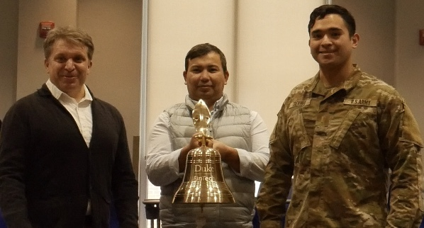
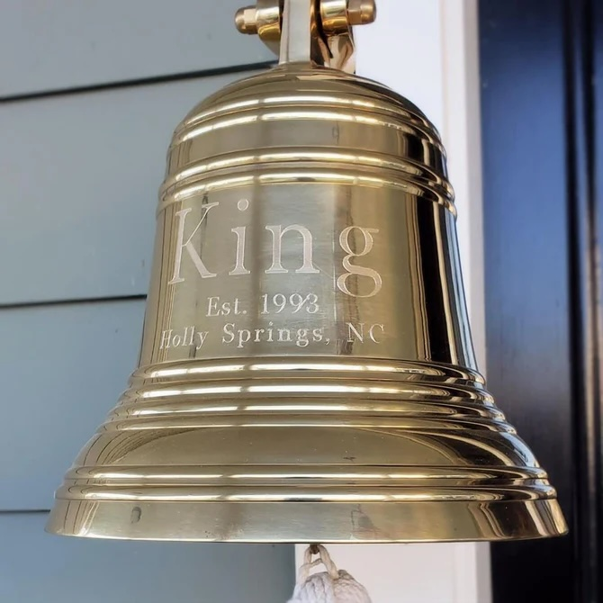

<h2>The Duke FinTech Trading Competition now operates on a continual rolling basis!</h2>

<a href="https://gothic-hedge-society.github.io/fintech.trading.competition/articles/sign_up.html" style="font-size:30px">Click this link to sign up</a>

 

We now support signing up throughout the year for any and all who wish to participate, regardless of university student status.

 

Rules regarding the Fall 2026 competition will be updated here 
in August 2026. Until then, congratulations to our 2026 winners! 
You can view the standings in the 
<a href="https://fintechtradingcompetition.com/articles/scoreboard.html" style="font-size:24px">Standings</a>
page. 

Winning traders will have their name engraved on a plaque under our official Trading Competition  bell where they will bask in glory alongside other past winners over the years to come.

<h3 style="padding-top:5px;padding-left:51px">Winner's Bell</h3>

# ABOUT:

The Duke FinTech Trading Competition is a 3-month long event in which
student traders from around the world create paper trading accounts at
Interactive Brokers and trade anything they want, including stocks,
bonds, options, futures, currencies, crypto, and [any of the other
products offered by Interactive
Brokers](https://www.interactivebrokers.com/en/trading/products-invest-prod.php).

Due to the way in which we score & rank our participants, if you do well
in this competition, it’s because you’re a good trader. Furthermore,
we’ve introduced a *bracket* system this year to keep ALL of our traders
interested and engaged. In the new system, even if you don’t stand much
chance of taking the \#1 spot overall, you can still compete for a top
rank *within your bracket*, giving you a hard-earned accomplishment that
you can report on your resume or CV.

To see how we accompilsh all this – and what makes us special – check
out our [scoring
philosophy](https://gothic-hedge-society.github.io/fintech.trading.competition/articles/Scoring.html).
Then you can begin the [sign
up](https://gothic-hedge-society.github.io/fintech.trading.competition/articles/sign_up.html)
process!

As a participating trader in this competition you will:

- Download Trader Workstation (Interactive Brokers’ professional-grade
  trading platform) and use it to trade real assets with real market
  prices using simulated money
- Join the Gothic Hedge Hub (our companion Discord Server) which you can
  use to communicate with other traders, the Competition admins, and
  industry sponsors
- Gain a chance to show recruiters and the world your trading skills

Go ahead and join now! We’ll look forward to seeing you in the Discord
server :)
