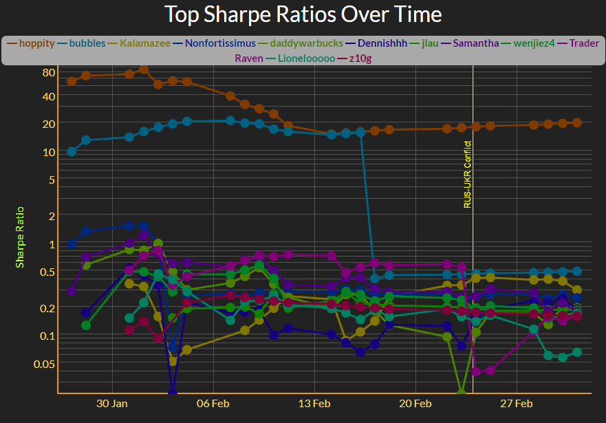

```{r, include = FALSE}
knitr::opts_chunk$set(
  collapse = TRUE,
  comment = "#>"
)
```


```{r, echo = FALSE}
shiny::tagList(
  shiny::fluidRow(
    shiny::fluidRow(
      shiny::column(width = 6, shiny::p("04 Mar 2022", class = "article-date"))
      # ,
      # shiny::column(
      #   width = 6,
      #   shiny::p(
      #     shiny::a(
      #       "Link to Official Announcement",
      #       href="https://fintech.meng.duke.edu/news/duke-fintech-intercollegiate-trading-competition-kicks-spring-2022"
      #     ),
      #     class = "original-article-link"
      #   ),
      # )
    ),
    shiny::p(
      "Duke FinTech Annual InterCollegiate\n\nTrading Competition",
      class = "announcement-title"
    )
  ),
  shiny::fluidRow(
    shiny::p("Sponsored by:"),
    class = "sponsored-by"
  ),
  shiny::fluidRow(
    style = "display: flex; align-items: center; justify-content: center;",
    shiny::column(
      width = 4, 
      shiny::a(shiny::img(src = "finvc_logo.png"), href = "https://finvc.co/")
    ),
    shiny::column(
      width = 4, 
      shiny::a(shiny::img(src = "horizen_logo.png"), href = "https://www.horizen.io/")
    ),
    shiny::column(
      width = 4,
      shiny::a(shiny::img(src = "mesh_logo.png"), href = "https://mesh.xyz/")
    )
  ),
  shiny::fluidRow(
    shiny::p(
      paste0(
        "This week saw a major reshuffling of the rankings following the ",
        "Russia/Ukraine conflict, testing each trader's ability to handle ",
        "political risk in their portfolios."
      ),
      class = "subtitle"
    )
  )
)
```



<p class = "basic-text"> Trader Raven suffered major losses initially, yielding 
2nd place to Bubbles, who continues to work a dependable low vol/low return 
strategy. Despite the setback, Trader Raven continues to post impressive returns
and is steadily climbing back up in the rankings.</p>

<p class = "basic-text"> Hoppity remains in first place, successfully executing
on a very dependable low vol/low return strategy similar to Bubbles'.</p>

<p class = "basic-text"> Three newcomers have entered the coveted Top 5 Sharpe 
Ratio rankings:</p>

<ol>
  <li><b>Nonfortissimus</b>, of UNC Chapel Hill, and a veteran of the 2021 Duke 
  FINTECH Trading Competition</li>
  <li><b>Kalamazee</b> of Washington University in St Louis</li>
  <li><b>daddywarbucks</b> of Georgetown University
</ol>
  

<p class = "basic-text">We have reached out to each trader for commentary and 
will update this site as responses come in!</p>


```{css, echo = FALSE}
h1, .dont-show {
display: none;
}

.announcement-title {
text-align: center;
font-size: 54px;
margin-top: 30px;
color: #FFD960;
}

.basic-text{
padding-top:10px;
padding-bottom:10px;
}

.basic-link, .basic-text, .quote{
font-size:18px;
}

.school-name{
color: Cornsilk;
font-size:19px;
}

.subtitle{
color:#bdd9d9;
font-size:25px;
font-style:italic;
text-align:center;
}

.sponsored-by{
font-size:25px;
font-style:bold;
text-align:center;
}

.article-date{
padding-top:10px;
text-align:left;
font-weight:bold;
color:#FCF7E5;
}

.original-article-link{
padding-top:10px;
text-align:right;
}

.quote {
color:#FCF7E5;
}

.table-header {
color:#FFD960;
font-size:22px;
}

```

