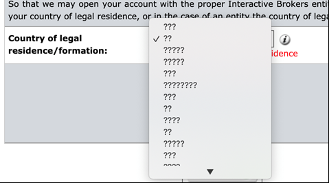
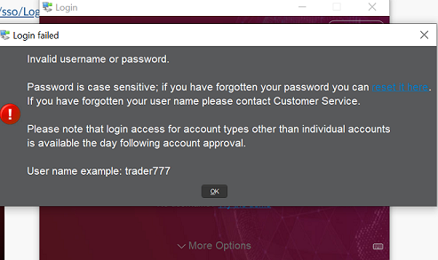

```{r, include = FALSE}
knitr::opts_chunk$set(
  collapse = TRUE,
  comment = "#>"
)
```

#### Registration for the 2022 Duke FINTECH Trading Competition is now closed.

**To sign up for participation in the Trading Competition, follow these steps**:

### Step 0: Eligibility
You must be a currently enrolled graduate or undergraduate student with a
'.edu' email address.

### Step 1: Sign up
Visit the [registration
page](https://dukefinance.wufoo.com/forms/2022-duke-fintech-trading-competition/).
Fill out the form there and submit your information.
* **You must use your '.edu' email address**, otherwise your registration will
be ignored. 

* You'll be asked for a 'tradername' -- choose wisely! You may use
your real name if you want, but understand that when daily standings and
performance updates are pushed to the website, this is the name that will appear
to the world alongside your school, department, and username.
    
### Step 2: Join the official Competition Slack Channel 
You will receive an automatic email welcoming you to the Competition and
providing you a link to join the official Competition Slack channel. **Follow
the link and join the channel -- you should use your tradername as your Slack
username here**. The Slack channel is the means by which you can communicate
with the Competition admin and the other contestants. There, you can share
strategies, meet new people, and ask any questions you have about trading, the
TWS platform, or any other technical issues you might encounter. This channel is
monitored by the Competition creator and we strive to fix any technical issues
that crop up as soon as possible.
    
### Step 3: Create your Interactive Brokers (IBKR) Paper Trader
Within one **business day** from the date on which you sign up, you'll receive
an invitation from Interactive Brokers (IBKR) to create the paper trading
account you'll be using for this competition. The subject of the invitation is
**Paper Trading Account Invitation**, and the invitation email is sent from
"**donotreply@interactivebrokers.com**".
     
* Use the link in your invitation email to sign up for a paper trader.
* You **must** sign up for a paper trader even if you already have another
account with IBKR.
* If you haven't received the email within one business day from the day on
which you signed up (check your spam folder!!!).
* If you **still** can't find your paper trader invitation, send a Direct
Message (DM) to **The Architect** using the Slack channel.
    
**BE CERTAIN TO RECORD YOUR ACCOUNT ID, USERNAME, AND PASSWORD**.

This information appears in a yellow box after you complete and submit your
paper trading account information and it's critical for your participation in
the Competition. Note that your IBKR username is not the same thing as the
tradername you chose when you registered. Your tradername is how you appear to
the world on this website when scoring and statistics are published, whereas the
IBKR username is the one you'll use when you sign in to your paper trader.

**If you run into a bunch of ????? when selecting your country**...
<center></center>

...try changing the primary language to 'English' within your browser. DM The
Architect on Slack if you still have trouble.

### Step 4: DM **The Architect**
Send your tradername, IBKR username, and IBKR Paper Trading Account ID to
**The Architect** as a Slack DM. Your Account ID will be a string starting with
'DU' followed by seven numbers ('DU1234567'). Feel free to say 'hi' to
**The Architect** if you feel like it.
    
### Step 5: Wait. 
It takes about **one business day** -- sometimes two or three -- for your paper
trading account to fully activate. Most of that time is due to obtaining your
permissions for market data subscriptions from the various market exchanges
around the world.

### Step 6: Explore 
Visit the [Getting Started](https://gothic-hedge-society.github.io/fintech.trading.competition/articles/fintech-trading-competition.html) 
page. Install TWS and explore the Demo account for a bit while you wait for your
account to activate.

### Step 7: ACTIVATED!
You'll know your account is ACTIVE when:
    - you can log in to TWS with the credentials you set up in **Step 3**. 
    - Sometimes there will be an awkward **'limbo period'** during which you'll
    be able to log in to your PORTAL using a browser, but you'll get an
    "**invalid username or password** error when you try logging in to TWS:

<center>  </center>

If this happens, **don't try to reset your password yet**! This may only mean
that your account is **created**, but not yet **active**. You will probably be
able to log in to TWS on the next business day with no problem. If you still
can't log in after one business day, send a Slack DM to **The Architect**.

### Step 8: Check the [Registry](https://gothic-hedge-society.github.io/fintech.trading.competition/articles/registry.html)
Confirm that the correct Account ID appears next to your tradername in the
[Registry](https://gothic-hedge-society.github.io/fintech.trading.competition/articles/registry.html)

### Step 9: Patience
As you wait for scoring to start, please be patent for a few days if there are
other traders still setting up their accounts!
